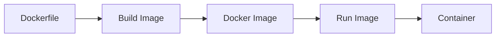

## 🧠 Topic 5: Optimizing Dockerfiles

### 🧠 Best Practices:
- Use slim base images (`node:18-slim`)
- Group `COPY` and `RUN` to minimize layers
- Use `.dockerignore` to skip unnecessary files
- Don’t run apps as root — add a user

### 🧪 Tip:
```Dockerfile
# .dockerignore example
node_modules
Dockerfile
.git
```
---

### 🍼 Explain Like I’m 5:
Don’t put garbage in your lunchbox 🧃🍪
- Pack only what you’ll eat
- Wrap it nicely
- Don’t squish it! 🧺

That’s what optimizing your Dockerfile does — makes your lunch (app) lighter, cleaner, and tastier!

## 🖼️ Diagram: Dockerfile to Container Flow



## ✅ Chapter Summary
- Dockerfile = recipe for building Docker images
- You can write your own image and run it as a container
- Use clear, efficient steps in your Dockerfile
- Always optimize to reduce size and boost performance
- Use `.dockerignore` to exclude unnecessary files